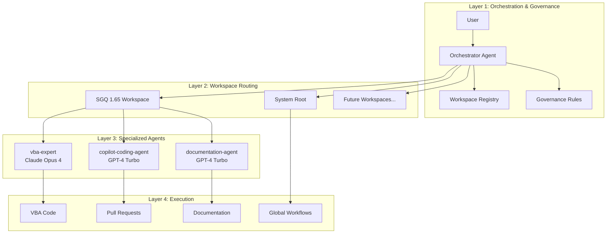

# Antigravity Architecture

## System Overview

The Antigravity system implements a **layered architecture** with clear separation of concerns between orchestration, specialized agents, governance, and experimentation.



## Architectural Layers

### Layer 1: Orchestration & Governance

**Purpose**: Single entry point, context identification, routing decisions

**Components**:
- **Orchestrator Agent**: Coordinates all interactions
- **Workspace Registry** (`workspaces.json`): Maps workspaces to configurations
- **Governance Rules**: Enforces workspace-specific policies

**Responsibilities**:
- Qualify user intent (planning/execution/verification)
- Identify target workspace
- Route to appropriate agent or workflow
- Enforce governance policies
- Refuse ambiguous or unsafe requests

### Layer 2: Workspace Routing

**Purpose**: Isolate workspace-specific configurations and rules

**Registered Workspaces**:

| Workspace       | Type           | Maturity | Agents               | Governance                           |
| :-------------- | :------------- | :------- | :------------------- | :----------------------------------- |
| **SGQ 1.65**    | Production     | High     | 3 specialized agents | Strict (CP1252, backups, validation) |
| **System Root** | Infrastructure | Low      | Orchestrator only    | Minimal                              |

**Routing Logic**:
1. Explicit workspace mention → Use that workspace
2. Keyword inference (VBA → SGQ, system → Root)
3. Current directory context
4. Refuse if ambiguous

### Layer 3: Specialized Agents

**Purpose**: Execute domain-specific tasks with expertise

#### SGQ 1.65 Agents

**vba-expert** (Claude Opus 4)
- **Capabilities**: VBA analysis, refactoring, error handling, audit compliance
- **Use Cases**: Complex refactoring, Step 11.4 patterns, architectural changes
- **Constraints**: CP1252 encoding, French headers, English code

**copilot-coding-agent** (GPT-4 Turbo)
- **Capabilities**: Issue resolution, PR generation, test validation
- **Use Cases**: Bug fixes, feature implementation, automated PRs
- **Integration**: GitHub workflows, CI/CD validation

**documentation-agent** (GPT-4 Turbo)
- **Capabilities**: Documentation generation, architecture mapping, changelog management
- **Use Cases**: README updates, architecture docs, onboarding materials

### Layer 4: Execution

**Purpose**: Actual code changes, workflow execution, artifact generation

**Execution Types**:
- **Code Modifications**: VBA modules, PowerShell scripts
- **Pull Requests**: Automated via copilot-coding-agent
- **Documentation**: Architecture docs, README, CHANGELOG
- **Workflows**: Global workflows (fix-mojibake, vba-compile, etc.)

## Decision Authority Matrix

| Decision Type      | Example                              | Authority                       | Validation Required |
| :----------------- | :----------------------------------- | :------------------------------ | :------------------ |
| **Read-Only**      | List files, view code                | Agent (100%)                    | No                  |
| **Planning**       | Propose architecture                 | Agent proposes, Human validates | Yes (notify_user)   |
| **Safe Execution** | Run compilation check                | Agent (auto-run)                | No                  |
| **Destructive**    | Delete files, modify production code | Human only                      | Yes (BLOCKING)      |
| **Deployment**     | Push to main, release                | Human only                      | Yes (BLOCKING)      |

## Governance Rules

### Global Rules (All Workspaces)

1. **No Hallucination**: Never invent files, paths, or capabilities
2. **Context-First**: Always identify workspace before routing
3. **Delegation-Over-Action**: Orchestrator coordinates, doesn't execute
4. **Right to Refuse**: Ambiguous requests are refused with explanation

### Workspace-Specific Rules

#### SGQ 1.65 (Production)

- **Encoding**: CP1252 (Windows-1252) mandatory
- **Line Endings**: CRLF only
- **Backups**: Required before any modification (`.bak` files)
- **Language**: Code in English, comments in French
- **Headers**: French module headers with AUDIT, Objectif, Auteur, Date, Version, CHANGELOG
- **Validation**: Compilation check required via `test-vbide-and-compile.ps1`
- **Compatibility**: Excel 2013 to 365

#### System Root (Infrastructure)

- **Encoding**: UTF-8 acceptable
- **Backups**: Optional
- **Validation**: Optional
- **Operations**: Non-destructive only

## Integration Patterns

### Pattern 1: Orchestrator → Workflow

```
User Request → Orchestrator → Identify Workspace → Route to Workflow → Execute → Return Result
```

**Example**: "Fix mojibake in SGQ" → `/fix-mojibake` workflow

### Pattern 2: Orchestrator → Agent → Execution

```
User Request → Orchestrator → Identify Workspace → Route to Agent → Agent Plans → Human Validates → Execute
```

**Example**: "Refactor error handling" → `vba-expert` agent → Implementation plan → Approval → Code changes

### Pattern 3: Orchestrator → Refuse

```
User Request → Orchestrator → Ambiguous Context → Refuse → Request Clarification
```

**Example**: "Create a module" (no workspace specified) → Refuse → "Which workspace: sgq-1.65 or system-root?"

## Workspace Registry Schema

```json
{
  "registeredWorkspaces": [
    {
      "id": "workspace-id",
      "name": "Human-readable name",
      "path": "Absolute filesystem path",
      "type": "production|infrastructure|experimental",
      "maturity": "low|medium|high",
      "priority": 1,
      "agentConfig": "Path to agent config",
      "governance": {
        "encoding": "CP1252|UTF-8",
        "backupRequired": true|false,
        "validationRequired": true|false
      },
      "agents": [ /* agent definitions */ ],
      "workflows": [ /* workflow names */ ]
    }
  ]
}
```

## Future Enhancements

### Phase 2: Auto-Discovery (Optional)

Enable automatic workspace discovery:
- Scan `scratch/` and `playground/` directories
- Detect workspace markers (`.agent/`, `.github/copilot/`, `AGENTS.md`)
- Merge with registered workspaces
- Lower priority than registered workspaces

### Phase 3: Conversation Memory

Implement context persistence:
- Remember last-used workspace per user
- Learn workspace preferences
- Suggest workspace based on conversation history
- Auto-archive old conversation contexts

### Phase 4: Multi-Agent Collaboration

Enable agents to collaborate:
- `vba-expert` + `documentation-agent` for comprehensive refactoring
- `copilot-coding-agent` + `vba-expert` for complex PRs
- Orchestrator manages collaboration workflow

## Related Documentation

- [README](file:///C:/Users/AbelBoudreau/.gemini/antigravity/README.md) - User guide and quick start
- [Workspace Registry](file:///C:/Users/AbelBoudreau/.gemini/antigravity/workspaces.json) - Current workspace configuration
- [Orchestrator Prompt](file:///C:/Users/AbelBoudreau/.gemini/antigravity/.agent/orchestrator.md) - Orchestrator instructions
- [SGQ Agents](file:///C:/VBA/SGQ%201.65/AGENTS.md) - SGQ workspace agent documentation
- [Analysis Document](file:///C:/Users/AbelBoudreau/.gemini/antigravity/brain/e97b35d5-e8d1-41aa-9047-c77eb3426476/ANALYSIS_AND_ARCHITECTURE.md.resolved) - Original architecture analysis
