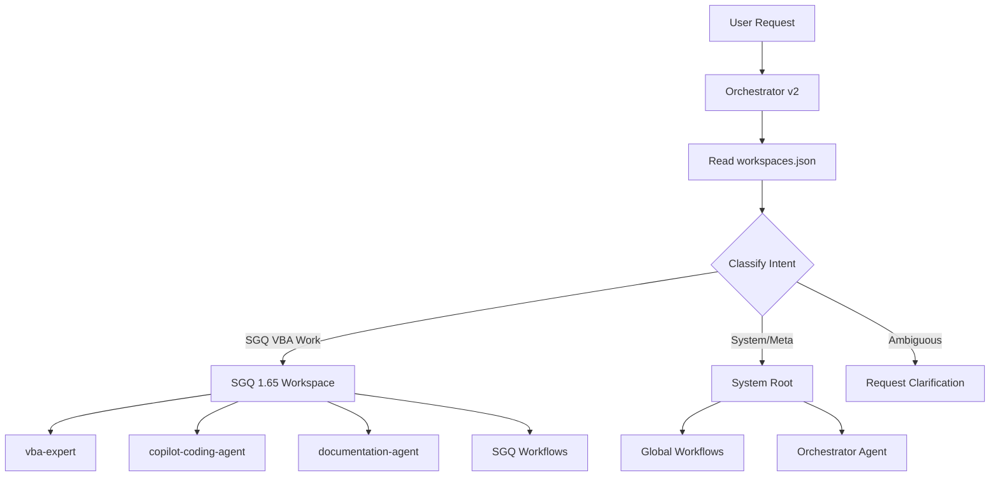

# Antigravity

A Python implementation of the famous XKCD "antigravity" Easter egg, inspired by [XKCD comic #353](https://xkcd.com/353/).

## What is this?

In the XKCD comic, a character demonstrates the power and simplicity of Python by typing `import antigravity`, which causes them to fly. This repository implements that joke as a real Python module.

## Features

- **Automatic flying**: Simply importing the module opens the XKCD Python comic in your default web browser
- **Geohashing**: Includes the XKCD geohashing algorithm from [XKCD comic #426](https://xkcd.com/426/)
- **Pure Python**: No external dependencies required

## Installation

You can install this package directly from the repository:

```bash
pip install git+https://github.com/ABCPA/Antigravity.git
```

Or clone and install locally:

```bash
git clone https://github.com/ABCPA/Antigravity.git
cd Antigravity
pip install -e .
```

## Usage

### Flying (Opening XKCD Comic)

Simply import the module to open the XKCD Python comic:

```python
import antigravity
```

Or call the `fly()` function explicitly:

```python
from antigravity import fly
fly()
```

### Geohashing

Use the geohashing algorithm to compute location offsets:

```python
from antigravity import geohash

# Compute geohash for a specific date and location
latitude = 37.421542
longitude = -122.085589
date_dow = b'2005-05-26-10458.68'

lat_offset, lon_offset = geohash(latitude, longitude, date_dow)
print(f"Latitude offset: {lat_offset}")
print(f"Longitude offset: {lon_offset}")
```

## How It Works

When you import the `antigravity` module, it automatically calls the `fly()` function, which uses Python's `webbrowser` module to open the XKCD Python comic in your default browser. This is a humorous reference to the comic's premise that Python is so powerful that a single import statement can make you fly.

The geohashing function implements the algorithm described in XKCD #426, which uses MD5 hashing to generate pseudo-random but deterministic location offsets based on a date and the Dow Jones opening value.

## About XKCD #353

The comic shows a character floating in the air, explaining to friends:

> "I wrote 20 short programs in Python yesterday. It was wonderful. Perl, I'm leaving you."
> 
> "I learned it last night! Everything is so simple! Hello world is just 'print "Hello, World!"'"
> 
> "I'm flying!"
> 
> "How are you flying?"
> 
> "Python!"
> 
> "I just typed 'import antigravity'"

This captures the joy and simplicity that many programmers feel when discovering Python.

## License

MIT License

## Credits

- Inspired by [XKCD comic #353](https://xkcd.com/353/) by Randall Munroe
- Geohashing algorithm from [XKCD comic #426](https://xkcd.com/426/)
- Original Python antigravity module in the standard library
# Antigravity Orchestrator

## Overview

The **Antigravity Orchestrator** is a coordination layer that routes user requests to the appropriate workspace-specific agents and workflows. It acts as the single entry point for all interactions, ensuring proper context identification, governance compliance, and intelligent delegation.

## Architecture



## Key Concepts

### Workspaces

A **workspace** is a directory with:
- Agent configuration (`.agent/` or `.github/copilot/`)
- Local workflows and rules
- Governance policies (encoding, backups, validation)

**Registered Workspaces:**
- **SGQ 1.65** (`C:\VBA\SGQ 1.65`): Production VBA quality system
- **System Root** (`C:\Users\AbelBoudreau\.gemini\antigravity`): Infrastructure and orchestration

### Workspace Registry

The registry file [`workspaces.json`](file:///C:/Users/AbelBoudreau/.gemini/antigravity/workspaces.json) contains:
- Workspace metadata (name, path, type, maturity)
- Agent configurations and capabilities
- Governance rules
- Available workflows

### Orchestrator Agent

The orchestrator **does not execute** tasks directly. Instead, it:
1. **Qualifies** the user's intent
2. **Identifies** the target workspace
3. **Routes** to the appropriate agent or workflow
4. **Synthesizes** results back to the user

## How It Works

### Request Flow

1. **User submits request** → Orchestrator receives it
2. **Orchestrator reads** `workspaces.json` to understand available workspaces
3. **Intent classification**:
   - Explicit workspace mention? Use that workspace
   - Keywords suggest workspace? (VBA → SGQ, system → Root)
   - Ambiguous? Refuse and ask for clarification
4. **Route to agent/workflow** in the identified workspace
5. **Return results** to user with context

### Example Scenarios

**Scenario 1: VBA Encoding Fix**
```
User: "Fix mojibake in the SGQ project"
→ Workspace: sgq-1.65 (explicit mention)
→ Action: Route to /fix-mojibake workflow
→ Result: Encoding corrected using CP1252
```

**Scenario 2: List Agents**
```
User: "What agents are available?"
→ Workspace: system-root (meta query)
→ Action: Read workspaces.json and AGENTS.md
→ Result: List of vba-expert, copilot-coding-agent, documentation-agent
```

**Scenario 3: Ambiguous Request**
```
User: "Create a new module"
→ Workspace: UNKNOWN
→ Action: REFUSE
→ Response: "Please specify workspace: sgq-1.65 or system-root?"
```

## Configuration Files

### Orchestrator Configuration
- **Location**: [`.agent/orchestrator.json`](file:///C:/Users/AbelBoudreau/.gemini/antigravity/.agent/orchestrator.json)
- **Prompt**: [`.agent/orchestrator.md`](file:///C:/Users/AbelBoudreau/.gemini/antigravity/.agent/orchestrator.md)

### Workspace Registry
- **Location**: [`workspaces.json`](file:///C:/Users/AbelBoudreau/.gemini/antigravity/workspaces.json)
- **Schema**: Hybrid (registry + optional auto-discovery)

### Global Workflows
- **Location**: `global_workflows/`
- **Available**: fix-mojibake, git-commit, gov-check, python-audit, vba-* workflows

## Governance Rules

The orchestrator enforces workspace-specific governance:

### SGQ 1.65 Rules
- **Encoding**: CP1252 (Windows-1252) mandatory
- **Line Endings**: CRLF
- **Backups**: Required before any modification
- **Language**: Code in English, comments in French
- **Validation**: Compilation check required

### System Root Rules
- **Backups**: Not required
- **Validation**: Optional
- **Operations**: Non-destructive only

## Adding a New Workspace
To register a new workspace:

1. **Edit** `workspaces.json`
2. **Add entry** to `registeredWorkspaces` array:
   ```json
   {
     "id": "my-workspace",
     "name": "My Workspace",
     "path": "C:\\Path\\To\\Workspace",
     "type": "production|infrastructure|experimental",
     "maturity": "low|medium|high",
     "priority": 3,
     "agentConfig": ".agent/config.json",
     "governance": { /* rules */ }
   }
   ```
3. **Test** by asking orchestrator: "What workspaces are available?"

## Future Enhancements

### Phase 2: Auto-Discovery (Optional)

Enable automatic discovery of workspaces in `scratch/` and `playground/` directories:

1. Set `autoDiscovery.enabled: true` in `workspaces.json`
2. Orchestrator will scan `searchRoots` for workspace markers
3. Discovered workspaces are merged with registered ones

### Phase 3: Conversation Memory

Implement context persistence across conversations:
- Remember last-used workspace
- Learn user preferences
- Suggest workspace based on history

## Troubleshooting

**Problem**: Orchestrator can't find workspace
- **Solution**: Verify path in `workspaces.json` matches actual directory

**Problem**: Wrong workspace selected
- **Solution**: Be explicit in request: "In SGQ workspace, fix encoding"

**Problem**: Agent not found
- **Solution**: Check `agents` array in workspace registry entry

## Related Documentation

- [Workspace Discovery Analysis](file:///C:/Users/AbelBoudreau/.gemini/antigravity/brain/e97b35d5-e8d1-41aa-9047-c77eb3426476/ANALYSIS_AND_ARCHITECTURE.md.resolved)
- [SGQ Agents Configuration](file:///C:/VBA/SGQ%201.65/AGENTS.md)
- [Implementation Plan](file:///C:/Users/AbelBoudreau/.gemini/antigravity/brain/aa271dc3-4092-484a-ba77-7a022ffb1849/implementation_plan.md)

